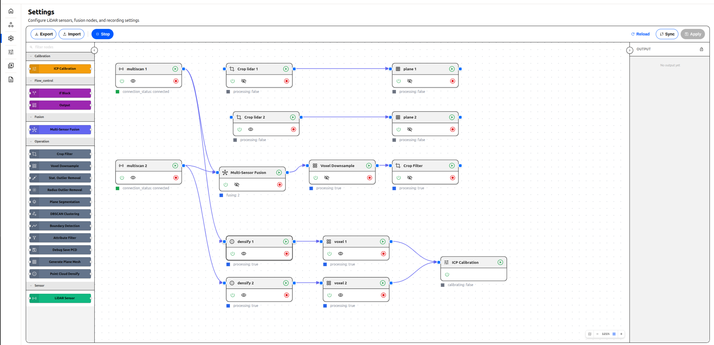

# lidar-standalone

A standalone Python backend for real-time LiDAR point cloud processing and streaming. Built with FastAPI, Open3D, and the SICK Scan API. Supports multiple sensors, modular processing pipelines, multi-sensor fusion, and live WebSocket streaming to a browser frontend.



---

## Features

- **Modern Angular frontend** — reactive UI with real-time node status monitoring and WebGL 3D visualization
- **Multi-sensor support** — run multiple LiDAR sensors simultaneously, each in its own isolated process
- **Enable/disable nodes** — control sensor and fusion availability via UI without restarting
- **Runtime status monitoring** — real-time process health, frame rates, and error reporting
- **Modular pipeline system** — compose point cloud operations using a fluent builder API
- **Multi-sensor fusion** — merge point clouds from multiple sensors into a unified world-space cloud
- **Real-time WebSocket streaming** — binary point cloud data streamed to the frontend at full sensor rate
- **Simulation mode** — replay from a `.pcd` file without physical hardware
- **Sensor pose / transformation** — define each sensor's physical position and orientation; points are automatically transformed into world space
- **Dev-friendly** — gracefully handles missing hardware dependencies; surfaces errors in UI instead of crashing
- **Standalone builds** — create distributable executables for Linux and Windows

---

## Project Structure

```
lidar-standalone/
├── app/                    # Backend application
│   ├── api/               # FastAPI routes
│   ├── db/                # Database models & migrations
│   ├── pipeline/          # Point cloud processing pipelines
│   ├── repositories/      # Data access layer
│   ├── services/          # Core business logic
│   │   ├── lidar/        # LiDAR sensor management
│   │   └── websocket/    # WebSocket streaming
│   └── static/            # Built Angular frontend (generated)
├── config/                 # Runtime configuration & database
├── docs/                   # Documentation
│   ├── BUILD.md           # Build system documentation
│   ├── PLUGIN_GUIDE.md    # Pipeline plugin development
│   └── ...
├── examples/               # Demo files and ROS launch configs
│   ├── demo.png           # Screenshot
│   └── launch/            # SICK sensor launch files
├── scripts/                # Build and run scripts
│   ├── build.sh           # Build standalone executable
│   ├── standalone.py      # PyInstaller entry point
│   ├── lidar-standalone.spec  # PyInstaller config
│   ├── run.sh             # Run development server
│   └── run_sim.sh         # Run in simulation mode
├── tests/                  # Unit and integration tests
├── web/                    # Angular frontend application
├── main.py                 # Development entry point
└── requirements.txt        # Python dependencies
```

---

## Requirements

- Python 3.12+
- Docker (required to build the SICK Scan native library)

---

## Installation

### 1. Create Virtual Environment

```bash
# Create and activate virtual environment
python3 -m venv .venv
source .venv/bin/activate

# Install dependencies
pip install -r requirements-dev.txt
```

### 2. Build SICK Scan API

This script uses Docker to build the library and copy the artifacts (drivers, launch files, and Python API) into the project directory.

```bash
cd setup
./setup.sh
cd ..
```

---

## Running

### Real hardware

```bash
export LD_LIBRARY_PATH=.:./build:$LD_LIBRARY_PATH
export PYTHONPATH=.:./sick-scan-api/api:$PYTHONPATH
python3 main.py
```

### Simulation (PCD file replay)

```bash
./scripts/run_sim.sh
```

Frontend available at: `http://localhost:8004`

### Building Standalone Executables

```bash
./scripts/build.sh
```

Creates a distributable executable in `dist/lidar-standalone/`. See [docs/BUILD.md](docs/BUILD.md) for details.

### Environment variables

| Variable         | Default                                   | Description                  |
| ---------------- | ----------------------------------------- | ---------------------------- |
| `HOST`           | `0.0.0.0`                                 | Server bind address          |
| `PORT`           | `8005`                                    | Server port                  |
| `DEBUG`          | `false`                                   | Enable hot-reload            |
| `LIDAR_MODE`     | `real`                                    | `real` or `sim`              |
| `LIDAR_LAUNCH`   | `./examples/launch/sick_multiscan.launch` | Launch file path             |
| `LIDAR_PCD_PATH` | `./test.pcd`                              | PCD file for simulation mode |

---

## Node Setup

**Note:** Sensors and processing nodes are persisted in SQLite (`config/data.db`) and managed via the **Flow Canvas UI** (`http://localhost:8004/settings`) or REST API.

For programmatic setup, nodes are created via the `/api/v1/nodes` REST endpoint:

```bash
curl -X POST http://localhost:8005/api/v1/nodes \
-H "Content-Type: application/json" \
-d '{
  "name": "Front Lidar",
  "type": "sensor",
  "category": "Input",
  "enabled": true,
  "config": {
    "topic_prefix": "front",
    "launch_args": "./launch/sick_multiscan.launch hostname:=192.168.1.10",
    "mode": "real",
    "pose": {"x": 0.0, "y": 0.0, "z": 0.5, "yaw": 180.0, "pitch": 0.0, "roll": 0.0}
  }
}'
```

Each sensor runs in its own subprocess. Points are automatically transformed into world space using the sensor's pose (angles in degrees) before broadcasting.

---

## Pipeline System

Pipelines are composed using the fluent `PipelineBuilder` API and registered by name in `app/pipeline/factory.py`.

### Built-in operations

| Method                                         | Description                       |
| ---------------------------------------------- | --------------------------------- |
| `.crop(min, max)`                              | Axis-aligned bounding box crop    |
| `.downsample(voxel_size)`                      | Voxel grid downsampling           |
| `.uniform_downsample(every_k)`                 | Keep every k-th point             |
| `.remove_outliers(nb_neighbors, std_ratio)`    | Statistical outlier removal       |
| `.remove_radius_outliers(nb_points, radius)`   | Radius-based outlier removal      |
| `.segment_plane(distance_threshold)`           | RANSAC plane segmentation         |
| `.cluster(eps, min_points)`                    | DBSCAN clustering, removes noise  |
| `.filter(reflector=True, intensity=('>',0.5))` | Filter by point attribute         |
| `.debug_save(output_dir, prefix)`              | Save PCD snapshots to disk        |
| `.save_structure(output_file)`                 | Save point cloud metadata to JSON |
| `.add_custom(operation)`                       | Add a custom `PipelineOperation`  |

### Creating a new pipeline

1. Add a file in `app/pipeline/impl/my_pipeline.py`:

```python
from ..operations import PipelineBuilder

def create_pipeline(lidar_id: str = "default"):
    return (PipelineBuilder()
            .downsample(voxel_size=0.05)
            .remove_outliers(nb_neighbors=20, std_ratio=2.0)
            .build())
```

2. Register it in `app/pipeline/factory.py`:

```python
from .impl import basic, advanced, reflector, my_pipeline

_PIPELINE_MAP: dict[str, Callable] = {
    "basic":      basic.create_pipeline,
    "advanced":   advanced.create_pipeline,
    "reflector":  reflector.create_pipeline,
    "my_pipeline": my_pipeline.create_pipeline,   # ← add here
}

PipelineName = Literal["basic", "advanced", "reflector", "my_pipeline"]  # ← and here
```

3. Use it:

```python
lidar_service.generate_lidar(sensor_id="lidar1", ..., pipeline_name="my_pipeline")
```

---

## Multi-Sensor Fusion

`FusionService` is an opt-in module that merges point clouds from multiple sensors into a single unified cloud, broadcast on a dedicated WebSocket topic.

**Note:** With the node architecture, fusion is modeled as just another node type (`type: "fusion"`) that accepts inputs from sensor nodes. The relationships between them are stored as Edges in the database.

Example Fusion POST:

```json
{
  "name": "Global Fused Cloud",
  "type": "fusion",
  "category": "Processing",
  "enabled": true,
  "config": {
    "topic": "fused_points",
    "sensor_ids": ["lidar_front_id", "lidar_rear_id"],
    "pipeline_name": "advanced"
  }
}
```

Fusion only fires once **all expected sensors** have contributed at least one frame. Points are already in world space (transformation applied per-sensor) before merging.

---

## WebSocket Protocol

Data is broadcast as binary frames in the following format:

| Field       | Size         | Type         | Description          |
| ----------- | ------------ | ------------ | -------------------- |
| Magic       | 4 bytes      | `char[4]`    | `LIDR`               |
| Version     | 4 bytes      | `uint32`     | `1`                  |
| Timestamp   | 8 bytes      | `float64`    | Unix timestamp       |
| Point count | 4 bytes      | `uint32`     | Number of points `N` |
| Points      | N × 12 bytes | `float32[3]` | X, Y, Z per point    |

### Topics

Each sensor generates two topics (where `{prefix}` is the sensor's `topic_prefix`):

| Topic                       | Description                                                            |
| --------------------------- | ---------------------------------------------------------------------- |
| `{prefix}_raw_points`       | Raw (unprocessed) points for a single sensor                           |
| `{prefix}_processed_points` | Pipeline-processed points for a single sensor (if pipeline configured) |
| _(fusion topic)_            | Merged cloud from selected sensors (e.g., `fused_points`)              |

**Note:** Topic names are now derived from the sensor's persisted `topic_prefix` field, which is auto-generated from the sensor `name` and guaranteed unique.

---

## REST API

All API endpoints are under the `/api/v1` prefix:

| Method   | Path                         | Description                                                         |
| -------- | ---------------------------- | ------------------------------------------------------------------- |
| `GET`    | `/`                          | Serves the Angular SPA                                              |
| `GET`    | `/api/v1/status`             | System status (version, running state)                              |
| `GET`    | `/api/v1/nodes`              | List all nodes (sensors, fusions, etc)                              |
| `POST`   | `/api/v1/nodes`              | Create or update a node configuration                               |
| `DELETE` | `/api/v1/nodes/{id}`         | Delete a node configuration                                         |
| `PUT`    | `/api/v1/nodes/{id}/enabled` | Enable/disable a node (JSON payload: `{"enabled": true}`)           |
| `POST`   | `/api/v1/nodes/reload`       | Reload config and restart all nodes                                 |
| `GET`    | `/api/v1/nodes/status/all`   | **Runtime status** of all nodes (process health, frame age, errors) |
| `GET`    | `/api/v1/nodes/pipelines`    | List available processing pipelines                                 |
| `GET`    | `/api/v1/edges`              | List all edges (connections between nodes)                          |
| `POST`   | `/api/v1/edges/bulk`         | Save all edges (replaces existing graph layout)                     |
| `GET`    | `/api/v1/topics`             | List available WebSocket topics                                     |
| `WS`     | `/api/v1/ws/{topic}`         | WebSocket streaming endpoint                                        |
| `GET`    | `/api/v1/topics/capture`     | HTTP endpoint to capture a single point cloud frame from a topic    |
