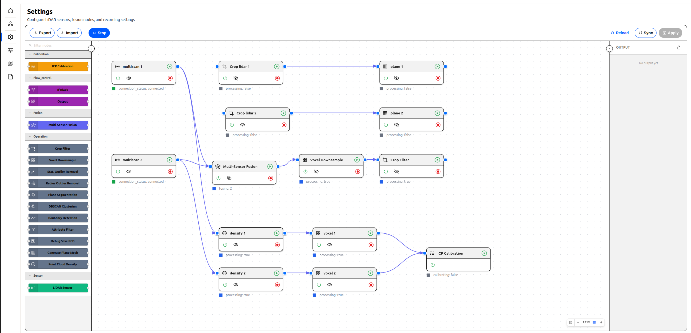

# lidar-standalone

Real-time LiDAR point cloud processing and 3D visualization. Multi-sensor support, modular pipelines, fusion, and live WebSocket streaming.

**Backend:** Python 3.12+, FastAPI, Open3D | **Frontend:** Angular, Three.js, Tailwind CSS



---

## Quick Start (Docker)

### Linux

```bash
docker compose up -d
```

### Windows

Open PowerShell **as Administrator** and run:

```powershell
Set-ExecutionPolicy Bypass -Scope Process -Force
.\install.ps1
```

This automatically installs WSL, Docker Engine, pulls the image, and starts the app. Supports Windows 10 & 11.

---

Open `http://localhost:8005` in your browser.

### Build the image yourself (optional)

```bash
docker build -f docker/Dockerfile -t lidar-standalone .
docker run --network host lidar-standalone
```

---

## Local Development Setup

### Prerequisites

- Python 3.12+
- Node.js 22+
- Docker (only needed to build the SICK Scan native library)

### 1. Backend

```bash
# Create virtual environment
python3 -m venv .venv
source .venv/bin/activate

# Install dependencies
pip install -r requirements-dev.txt
```

### 2. SICK Scan Library (optional, needed for real hardware)

```bash
cd setup && ./setup.sh && cd ..
```

### 3. Frontend

```bash
cd web
npm install
npm start          # Dev server at http://localhost:4200
```

### 4. Run the backend

```bash
# Set library paths (needed for real hardware only)
export LD_LIBRARY_PATH=.:./build:$LD_LIBRARY_PATH

# Start the server
python3 main.py
```

Backend runs at `http://localhost:8005`. Set `DEBUG=true` for hot-reload.

---

## Environment Variables

| Variable         | Default     | Description                  |
| ---------------- | ----------- | ---------------------------- |
| `HOST`           | `0.0.0.0`  | Server bind address          |
| `PORT`           | `8005`      | Server port                  |
| `DEBUG`          | `false`     | Enable hot-reload            |
| `LIDAR_MODE`     | `real`      | `real` or `sim`              |
| `LIDAR_PCD_PATH` | `./test.pcd`| PCD file for simulation mode |

---

## Project Structure

```
lidar-standalone/
├── app/                # Backend (FastAPI)
│   ├── api/            #   Routes
│   ├── pipeline/       #   Point cloud processing
│   ├── services/       #   Business logic (lidar, websocket)
│   └── static/         #   Built frontend (generated)
├── web/                # Frontend (Angular)
├── docker/             # Production Dockerfile
├── scripts/            # Build & run scripts
├── config/             # Runtime config & SQLite DB
├── tests/              # Tests
└── main.py             # Entry point
```

---

## Further Reading

- [Build System](docs/BUILD.md) — standalone executables for Linux/Windows
- [Plugin Guide](docs/PLUGIN_GUIDE.md) — creating custom pipeline operations
