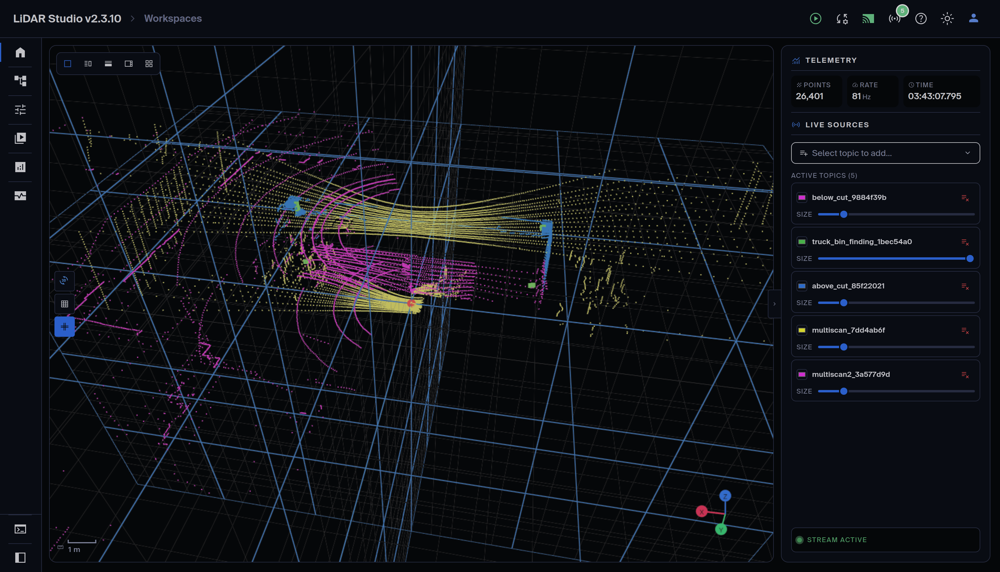
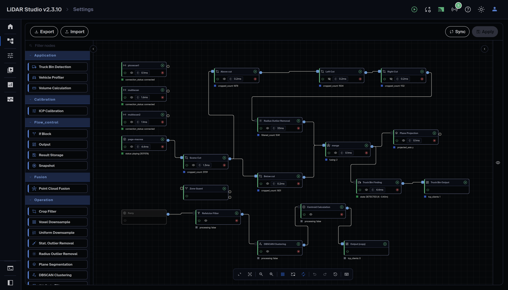
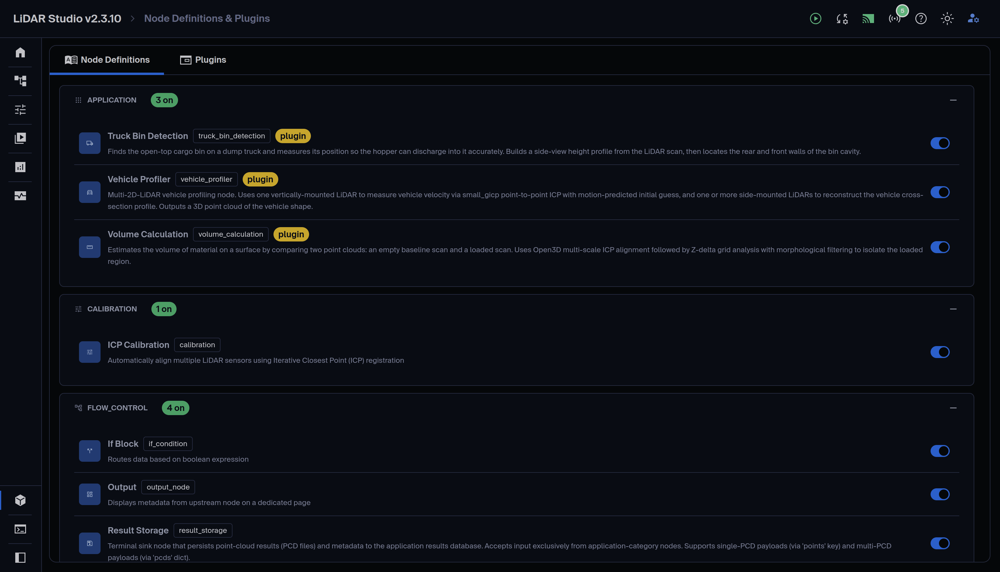

# LiDAR Studio

> Real-time LiDAR point cloud processing, 3D visualisation, and intelligent pipeline automation.

Built for industrial environments — multi-sensor fusion, modular processing pipelines, live WebSocket streaming, and a hot-pluggable plugin architecture for deploying custom algorithms without downtime.

---



| | |
|---|---|
|  |  |

---

## Tech Stack

| Layer | Technology |
|---|---|
| Backend | Python 3.12 · FastAPI · SQLAlchemy · SQLite |
| Point cloud | Open3D · NumPy · SciPy · small-gicp |
| Frontend | Angular 20 · Three.js (angular-three) · Tailwind CSS |
| UI components | Synergy Design System |
| Transport | REST `/api/v1/` · Binary WebSocket (LIDR protocol) |
| Plugin system | Hot-loadable Python packages — no restart required |

---

## Key Features

- **Visual pipeline editor** — drag-and-drop DAG with live node status
- **Real-time 3D viewer** — Three.js point cloud rendering streamed over WebSocket
- **Multi-sensor fusion** — combine LiDAR scans from multiple sensors in one pipeline
- **Plugin architecture** — upload custom processing nodes at runtime via REST API
- **Built-in algorithms** — volume calculation, vehicle profiler, truck bin detection, calibration
- **Recording & playback** — capture and replay raw sensor data
- **Role-based access** — user / admin / service tiers with JWT authentication

---

## Production (Docker)

### Linux / macOS

```bash
docker compose up -d
```

Open **http://localhost:8005**

### Windows

Open PowerShell as **Administrator**:

```powershell
Set-ExecutionPolicy Bypass -Scope Process -Force
.\install.ps1
```

Automatically installs WSL, Docker Engine, pulls the image, and starts the app. Supports Windows 10 & 11.

### Build the image yourself

```bash
docker build -f docker/Dockerfile -t lidar-studio .
docker run --network host lidar-studio
```

---

## Local Development

### Prerequisites

| Tool | Version | Notes |
|---|---|---|
| Python | 3.12.x | Managed via `uv` |
| Node.js | 22+ | For the Angular frontend |
| pnpm | latest | `npm i -g pnpm` |
| Docker | any | Only needed for SICK Scan native lib build |

### 1 · Backend

# Start the dev server (hot-reload)

```bash
uv run python main.py --DEBUG true
```

Backend available at **http://localhost:8005**

### 2 · Frontend

```bash
cd web
pnpm run start        # Dev server at http://localhost:4200
```

### 3 · SICK Scan library (optional — real hardware only)

```bash
cd setup && ./setup.sh && cd ..
```

---

## Environment Variables

| Variable | Default | Description |
|---|---|---|
| `HOST` | `0.0.0.0` | Server bind address |
| `PORT` | `8005` | Server port |
| `DEBUG` | `false` | Enable hot-reload and verbose logging |

---

## Project Structure

```
lidar-standalone/
├── app/                        # Backend (FastAPI)
│   ├── api/v1/                 #   REST endpoints
│   ├── modules/                #   Built-in processing nodes
│   │   ├── lidar/              #     Sensor drivers
│   │   ├── fusion/             #     Multi-sensor fusion
│   │   ├── pipeline/           #     Filters, transforms
│   │   └── application/        #     Application algorithms
│   ├── plugins/installed/      #   Hot-pluggable extension nodes
│   ├── services/nodes/         #   DAG orchestrator + NodeFactory
│   ├── db/                     #   SQLAlchemy models + migrations
│   └── schemas/                #   Pydantic request/response schemas
├── web/                        # Frontend (Angular 20)
│   └── src/app/
│       ├── features/           #   Lazy-loaded pages
│       ├── plugins/            #   Frontend node UI plugins
│       └── core/services/      #   API services, stores, WebSocket
├── tests/                      # pytest test suite
├── scripts/
│   └── pack_plugin.sh          # Validate + zip a plugin for upload
├── docker/                     # Production Dockerfile
└── main.py                     # Entrypoint
```

---

## Plugin Development

Custom processing algorithms can be packaged as plugins and uploaded at runtime — no redeploy needed.

```bash
# 1. Copy the template
cp -r app/plugins/installed/_template app/plugins/installed/my_algo

# 2. Implement registry.py + node.py  (see app/plugins/installed/README.md)

# 3. Validate + pack
bash scripts/pack_plugin.sh app/plugins/installed/my_algo

# 4. Upload to a running instance
curl -X POST http://localhost:8005/api/v1/nodes/plugins/upload \
     -F "file=@plugin_packages/my_algo.zip"
```

See [`app/plugins/installed/README.md`](app/plugins/installed/README.md) for the full contract and field reference.

---

## Tests

```bash
# All tests
uv run pytest

# Specific module
uv run pytest tests/api/ -v
```
